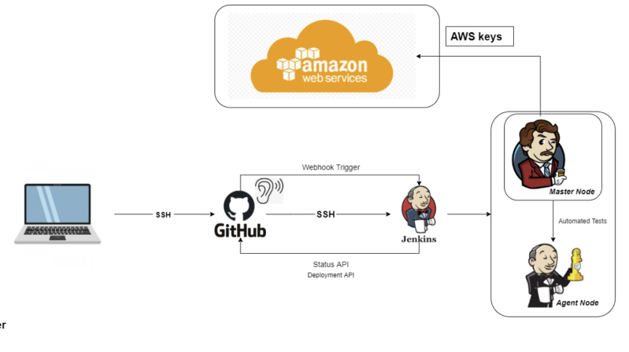
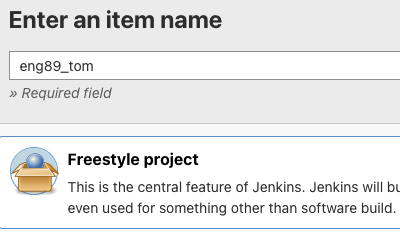
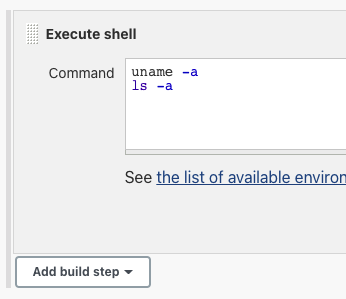
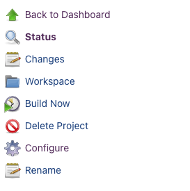
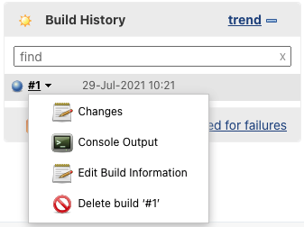
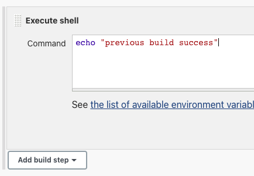
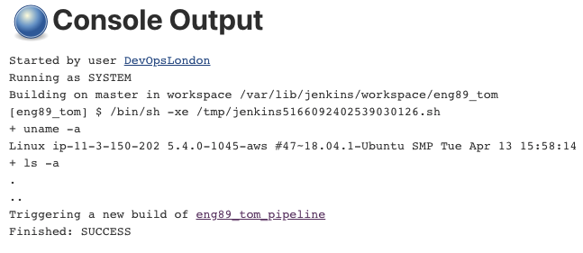
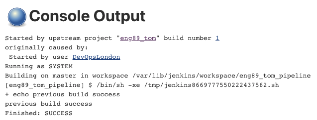

# Jenkins for CICD
- use Jenkins (open-source automation server) to automate testing and deployment if tests are passed
- create a new SSH key and paste public key into deployment keys in Jenkins repo

- in Jenkins homepage, 'new item' option creates a new job

- in the freestyle build, check "discard old buils" and set the max number to 3

- in the build steps select execute shell and type any linux commands here e.g. `uname -a` or `ls -a`

- in the project dashboard click 'build now' and select 'view console output' to see processes 

- to create a pipeline, select 'trigger other builds' in 'post build actions' and enter the name of the next build in the pipeline - build to be triggered must already be made

- for this, the second build has the same configuration but diffetrent shell commands

- now when running the first buid it will display a message saying the next build has been triggered, which can then be checked/viewed

