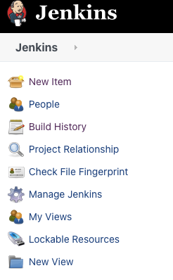
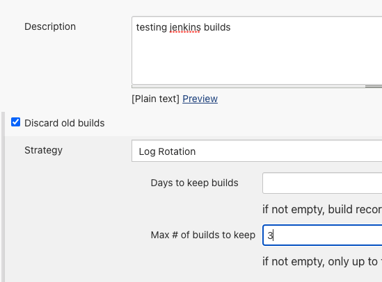
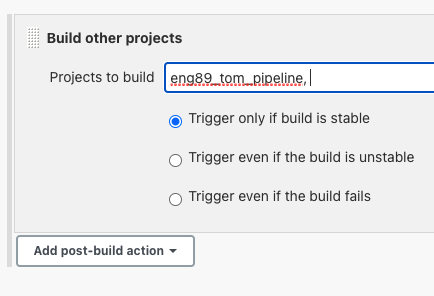

# Jenkins for CICD
- use Jenkins (open-source automation server) to automate testing and deployment if tests are passed
- create a new SSH key and paste public key into deployment keys in Jenkins repo

- in Jenkins homepage, 'new item' option creates a new job


- in the freestyle build, check "discard old builds" and set the max number to 3


- in the build steps select execute shell and type any linux commands here e.g. `uname -a` or `ls -a`

- in the project dashboard click 'build now' and select 'view console output' in the menu below to see processes 


- to create a pipeline, select 'trigger other builds' in 'post build actions' and enter the name of the next build in the pipeline - build to be triggered must already be made

- for this, the second build has the same configuration but diffetrent shell commands

- now when running the first build it will display a message saying the next build has been triggered, which can then be checked/viewed


## Pipeline for automated testing
- setup a build in the same way as above but with the below options selected as well:
- https of github repo containing the code

- restrict where it can be run

- source code management, SSH of repo and jenkins key - priv of pair that is in repo, main branch

- build environment, ensure correct plugins are checked

- build trigger


- shell commands
```linux
cd app
npm install
npm test
```

## Github webhook and merge pipeline
- change branch for above build to dev in source code management

- after above build, trigger next build to merge dev branch into main branch
### Merge job
- setup the same except:
- don't restrict where project can be run
- branches to build is main, and add this additional behaviour in source code management

- in execute shell run following commands:
```linux
git checkout main
git merge origin/dev
```
- setup the following post build action
